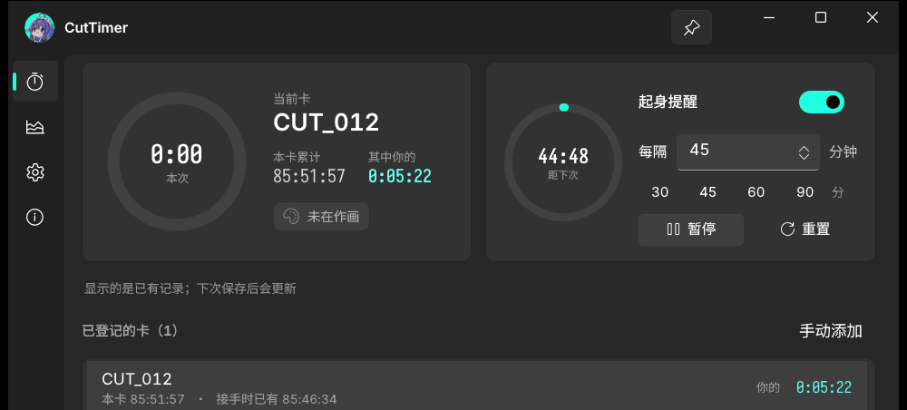
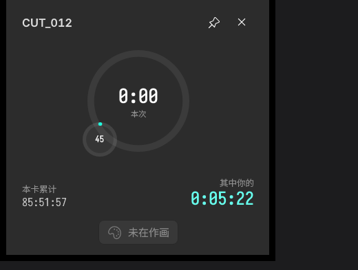
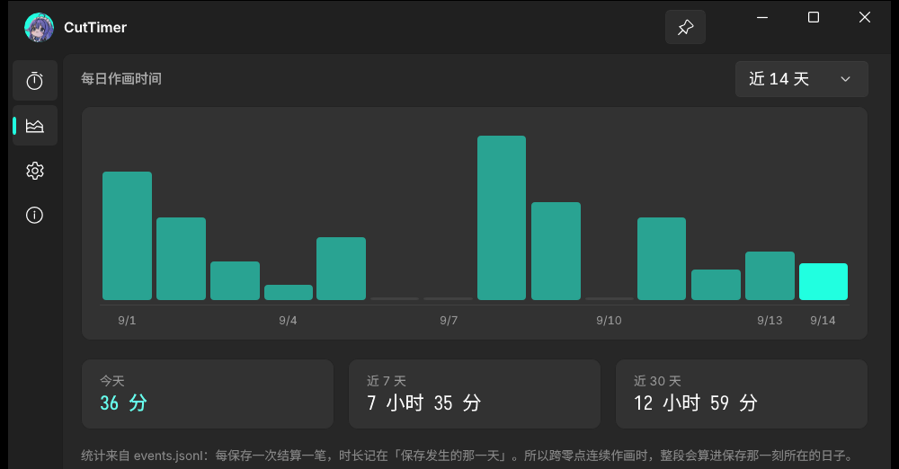

<div align="center">

# CutTimer

**卡耗时追踪器** — 记录你在 CLIP STUDIO PAINT 里每一张卡的实际作业时间

中文 | [English](README.en.md)


&nbsp;

&nbsp;

&nbsp;

&nbsp;




</div>

## 是什么

CSP 自己就记录作业时间（`資訊面板 → 作業時間`），判定也很准 —— 一段時間沒有操作畫布、
CSP 在背景運作、或是在操作其他畫布的時間，都会被判为中断、不记录。

但有两个现实问题：

1. **只能一张一张看**，没法汇总
2. **记录的是所有人累加的时间** —— 一卡文件会在 原画 → 作监 → 第二原画 → 动检 之间流转，
   直接读就等于把上游的时间算成你的

CutTimer 解决第 2 点：记下**第一次看到这张卡时的值当基线**，之后只累计增量，
上游那部分作为常量偏移被自动抵消。

```
首次看到：  CanvasWorkTime = 85:46:34   → 存为基线
一小时后：  CanvasWorkTime = 86:02:27   → 只把 15:53 记成你的
```

而且**不用手动启停**：CSP 只在保存时把时间写回文件，所以工具盯的是保存事件 ——
你按 `Ctrl+S`，它就结一次账，顺手把当前卡切过去。

## 功能

| | |
|---|---|
| **计时** | 当前卡计时 + 起身提醒倒计时（自绘圆环）。可暂停、可重置 |
| **统计** | 每日作画时间柱状图，今天 / 近 7 天 / 近 30 天汇总 |
| **悬浮小窗** | 始终置顶，与主窗互斥切换；可拖动、可缩放；左下角挂着提醒倒计时小圈 |
| **起身提醒** | 到点弹 Windows 通知 + 循环提示音，响到你处理为止。间隔 5~600 分钟任意填 |
| **自动登记** | 保存一次就自动登记，不用手动添加 |
| **自动发现目录** | 跟着 CSP 的「上次用的目录」走；也可以手动扫一遍磁盘 |

<div align="center">

&nbsp;&nbsp;

</div>

## 快速上手

从 [Releases](https://github.com/RaPluma/CutTimer/releases) 下载：

| 文件 | 大小 | 说明 |
|---|---|---|
| `CutTimer-1.0.0-win-x64.zip` | 63 MB | **解压即用**，不需要装任何运行时 |
| `CutTimer-1.0.0-win-x64-lite.zip` | 28 MB | 需要先装 [.NET 10 桌面运行时](https://dotnet.microsoft.com/download/dotnet/10.0) 和 [Windows App SDK 运行时](https://aka.ms/windowsappsdk/1.7/latest/windowsappruntimeinstall-x64.exe) |

解压后直接运行 `CutTimer.exe`。**未打包应用，没有安装程序。**

> **系统要求**：Windows 10 1809 (17763) 或更高，64 位。

**第一次用**：运行起来后，在 CSP 里打开一张卡、改两笔、按 `Ctrl+S` ——
这张卡就会出现在列表里，计时开始。

想确认提醒正常？把间隔设成 1 分钟等它到点，或者点提醒卡片上的「重置」。

## 已知限制

- **登记发生在「保存」时，不是「打开」时。** CSP 不持有打开文件的句柄、不暴露文档 API、
  窗口标题里也没有文件名 —— 外部确实无法知道你在画哪张（[六条路都试过了](docs/detection.md)）。
  所以打开新的卡之后按一次 `Ctrl+S` 就行。
- **跨零点的连续作画会算进保存那一刻所在的那天。**
- **启动时不扫盘。** 想找已有的作品文件夹请到设置页点「扫描磁盘…」，
  扫的过程有进度条和实时统计。

界面用**更纱黑体**（Sarasa Gothic）。没装会自动回退到系统字体，不会出方块，但装上更好看。

## 数据

```
%LOCALAPPDATA%\CutTimer\
├─ state.json   当前状态（原子替换写入）
└─ events.jsonl 结算账本（只追加，永不重写）
```

`events.jsonl` 是纯文本，每行一次结算，**不依赖本工具也能读**：

```jsonl
{"t":"2026-01-15T14:30:00+08:00","cut":"CUT_012","path":"...","delta":950000,"total":309117415,"mine":322837}
```

可以直接 `tail` 看、导入 Excel、或者写脚本算每日投入。因为只追加不重写，
**即使 `state.json` 被写坏，"我的时间" 也能从账本重算回来**。

## 开发

```sh
git clone https://github.com/RaPluma/CutTimer
cd CutTimer
dotnet publish -c Release -r win-x64 --self-contained true -o release
```

需要 .NET SDK 10。WinUI 3 + Windows App SDK，未打包（unpackaged）。

```
Core/
  ClipWorkTime.cs     读 .clip 内嵌 SQLite 的 CanvasWorkTime
  CutTracker.cs       核心：watcher + 轮询 + 差分结算
  WorkspaceScanner.cs 手动扫盘，把几百个目录折叠成少量监视根
  StateStore.cs       state.json + events.jsonl 的读写
  ReminderService.cs  提醒状态机
  TrayIcon.cs         纯 Win32 Shell_NotifyIcon 托盘
MainWindow / MiniWindow   主窗口与悬浮小窗
```

更细的东西写在 **[docs/](docs/)** 里：

- **[它是怎么知道你在画哪一卡的](docs/detection.md)** — 六条走不通的路、`.clip` 的内部格式、为什么要做差分
- **[实现笔记](docs/implementation.md)** — 数据存储取舍、WinUI 3 踩的坑、字体与素材的做法

<div align="center">
<br>
<strong>如果这个工具帮到你，点个 Star ⭐</strong><br><br>
<a href="https://github.com/RaPluma/CutTimer/issues">报告问题</a> ·
<a href="https://github.com/RaPluma/CutTimer/releases">查看 Releases</a>
</div>
